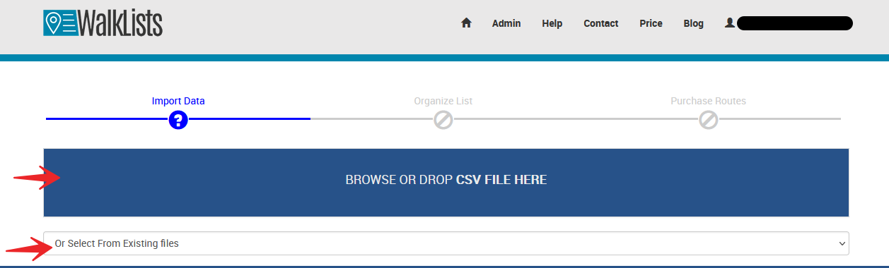
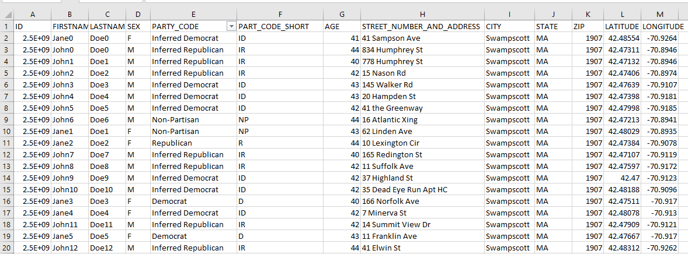
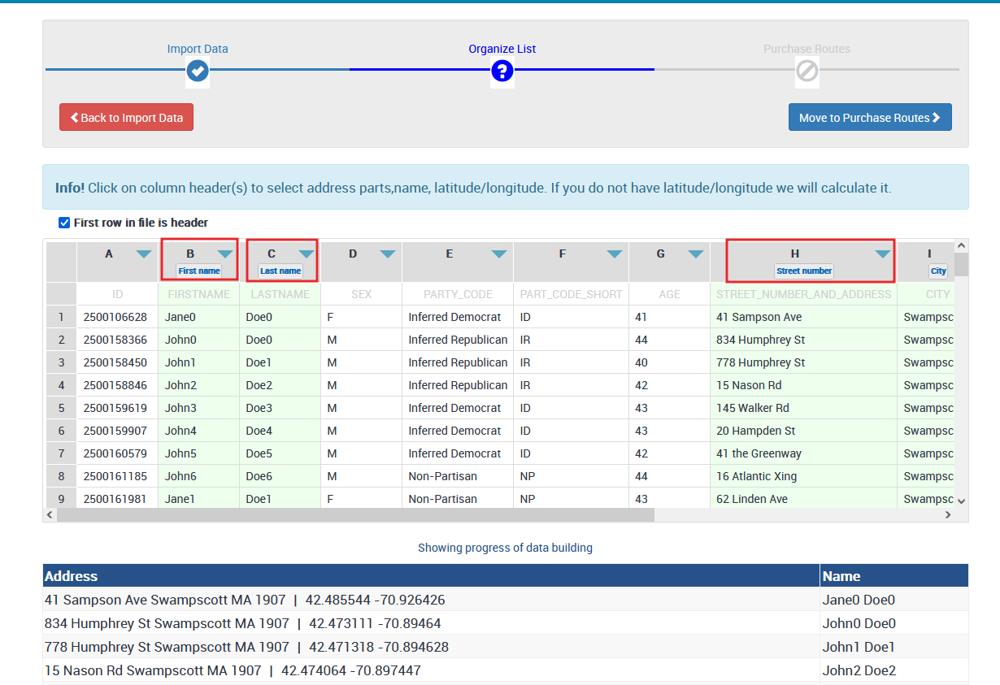
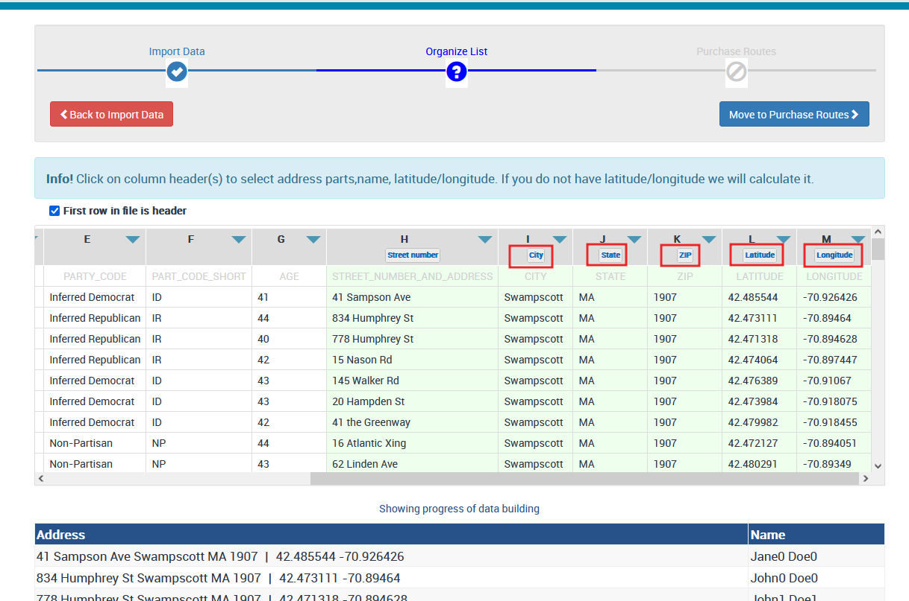
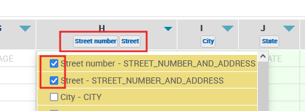
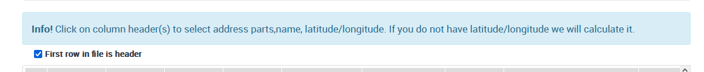
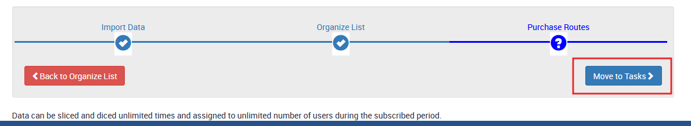

# Edit a Walk List Layout

**Remider - Users Can Create Unlimited Walk Lists**

This is a continuation from [Generate Walk List](../tutorials/canvassing-app/create-a-walklist/index.md)

[filename](edit-walklist-layout.mp4 ':include :type=video')

After the creation of the walk list is finalized, User can review, manipolate and adit the layout : either in PWA,mobile, or in PDF.
 

Before importing a file, we recommend the following:
Since much data is flowing around from unknown sources and formats are different, proper formating on the files is needed.
For a start, each column has to have clear header label. 
We do not require the coulumes  to be in any particular order so the user can stack them in anyway they want. 
Each row from the file has follow the rule that data flows left to right and cells that do not have data are left empty.

**Important**  Some files come with hundreds of columns. Importing all these columns into the system is too much and will create confusion for users. We recommend minimal valuable data that is needed to be imported.
Over the years we found that around20-40 columns are plenty for a statewide campaign. 

After the file gets uploaded, a visual grid shows the process of import. The system always tries to auto label the most important columns we track:

Continue to the right with the same file to show the rest of the columns

First Name

Last name

Street Number

Street Name

City

State

Zip code - 5 digits are more than enough

Country - if different from the USA

*Latitude

*Longitude

*Some files may not have latitude and longitude included. Not an issue. As part of the import, we will add Rooftop accuracy for each address by calculating Latitude and Longitude using our stellar product called <a href="https://csv2geo.com" target="_blank">CSV2GEO</a>. If users want to precalculate latitude and longitude, they can also use CSV2GEO on their own to do that and then import the files with WalkLists.

For the best outcome, we advise the user to go over each column and make sure they are properly labeled, and no duplications or missing parts are found.

The system is very flexible and can allow one column user to select multiple data tokens,
For example, if the user finds that first name and last name are combined into one column, the user can select both under that column.
Another example is shown here, where the street address was missing from the column selection. Only the street number was originally included. the user adds manually the street name and it is done. 

We recomend the user to double check the following data tokens:address tokens, names, latitude and longitude(if exists) before moving forward.

If some data tokens are mixed or not properly defined the user can later edit the data but any canvassing information that maybe was already tracked will be lost.

When the user is confident the data tokens are properly specified, the next step is to move to Next.

That workflow position is called Organize Lists and at this point WalkLists had decided to keep it undeveloped. We only give the user an information that reads: 

The next step is click MOve to tasks, where the user can see the formation of the campaign. Depends on the size of the campaign, it can take one to few min to form the campaign. It may take longer if we have to calculate latitude and longitude on the fly. Eventually the user is granted access to his/hers campaign as an admin with the option to enter into a license agreement with Scale Campaign by purshasing a subscription with walkLists. 

For how to process payment go to [Payment](../tutorials/canvassing-app/payment/index.md).

 

