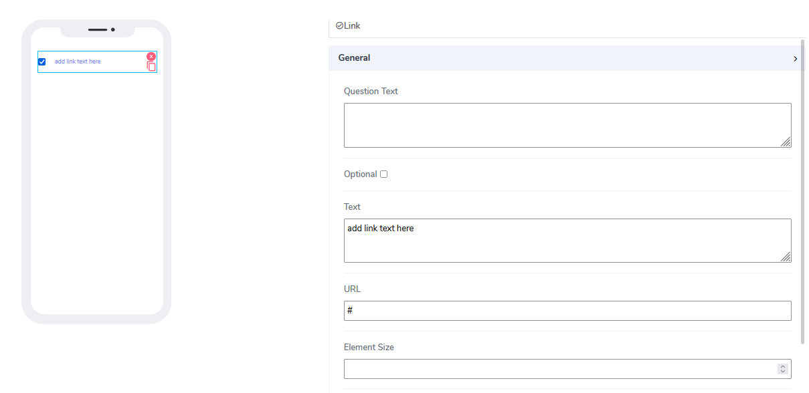
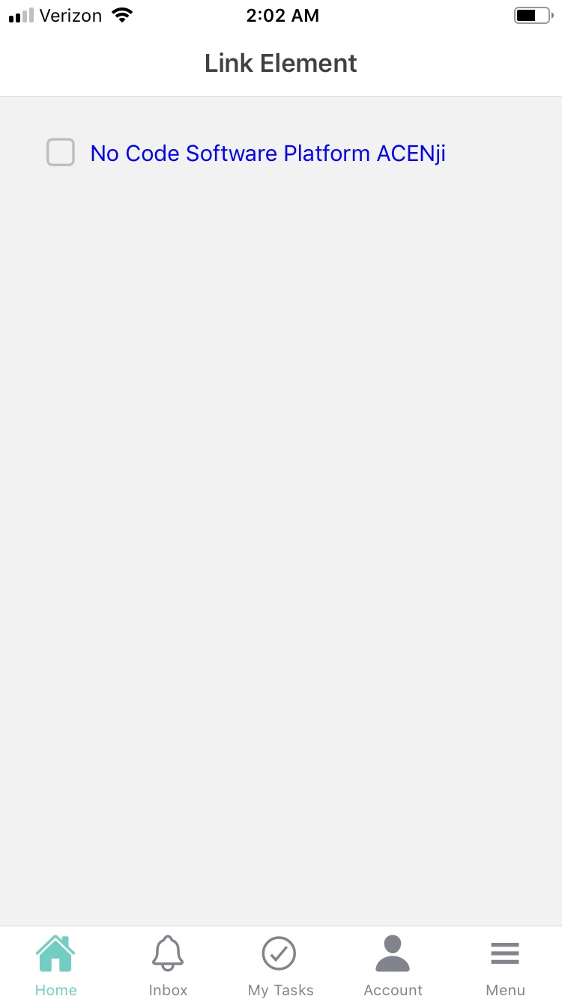

# Link Element

Link elements can be used for both **Forms** and **Cards**. Users are very much familiar with so-called links (URL).

It comes with the following attributes

- **Question Text** - Freestyle, multiline text. The text field is read-only. The text indicates to end-user what information they need to add an input.
- **Optional** - Indicate if this element is mandatory to be filled in at run time. By default this is not selected and therefore the element is mandatory.
- **Text** - The user can specify what the link text should read.
- **URL** - By default value is **#**. Users can specify any public URL: ex. https://acenji.com   
- **Element Size** - This field is empty by default. Users can add a numerical number here to indicate in pixels the size of the info message. The lower the size, the more lines are allocated to the text in order to define that size as a box on the canvas.
- **Inline** - Handy feature, where if selected the element gets glued to the previous element on the canvas. If there is no space to be added to the previous element, it positions itself with its own dimensions at the beginning of the canvas on the row where is located and the next element can be glued to it.

Questions?    <a href="https://www.acenji.com/contact" target="_blank" rel="noopener">Reach us for questions</a>   or <a href="https://github.com/acenji/acenji-help/issues" target="_blank" rel="noopener">post an issue here</a>

