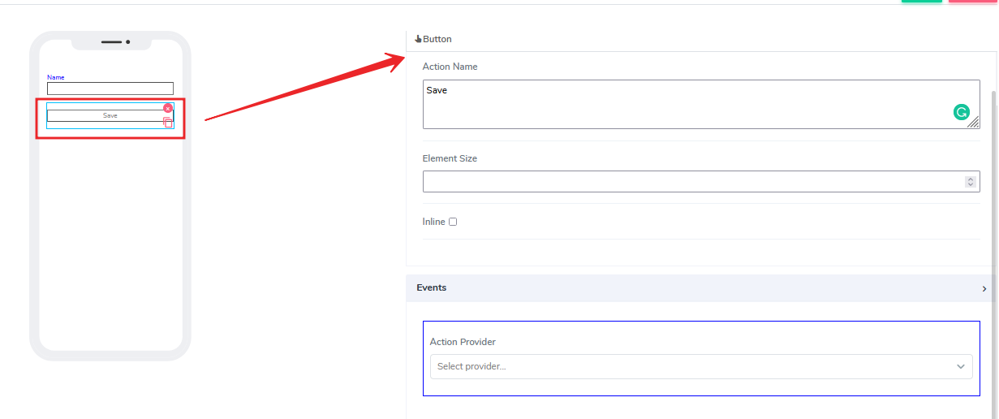
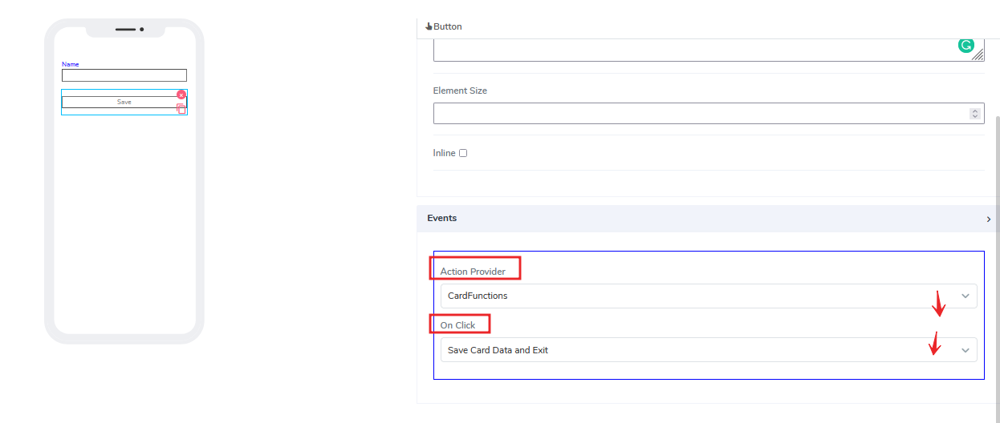
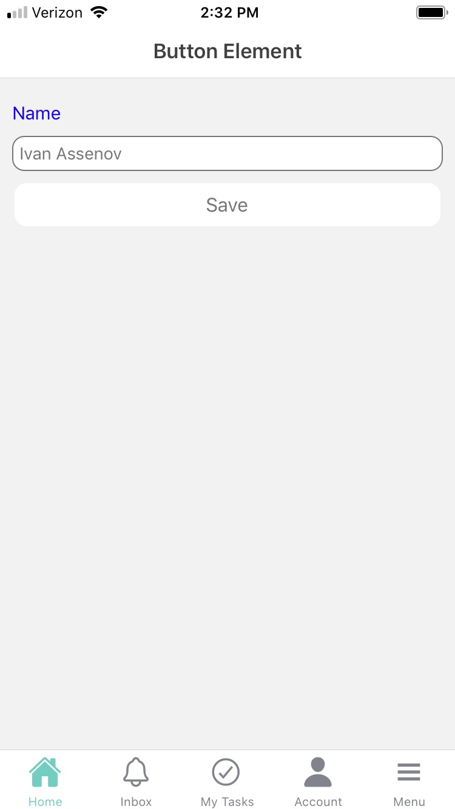

# Button Element

Button elements can be used for both **Forms** and **Cards**. Users are very much familiar with so-called "buttons" and how they facilitate an action when clicked.

It comes with the following attributes

- **Action Name** - Freestyle, multiline text. The text field is read-only. The text indicates to the end-user what action will follow if they press the button..
- **Element Size** - This field is empty by default. Users can add a numerical number here to indicate in pixels the size of the button. The lower the size, the smaller the button size is a box on the canvas.
- **Inline** - Handy feature, where if selected, the element gets glued to the previous element on the canvas. If there is no space to be added to the previous element, it positions itself with its own dimensions at the beginning of the canvas on the row where is located and the next element can be glued to it.
- **Events** - There are two selections users can do here. One is under Action provider to select for example card functions. Depending on what card functions are available, the user can pick in advance which one to be associated with the button. Then, after that user can select the actual click action. By default, we always provide save and exit actions.

Questions?    <a href="https://www.acenji.com/contact" target="_blank" rel="noopener">Reach us for questions</a>   or <a href="https://github.com/acenji/acenji-help/issues" target="_blank" rel="noopener">post an issue here</a>
 

