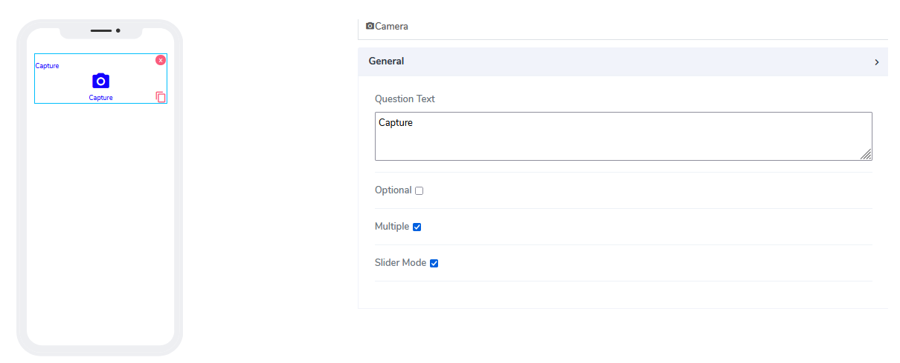
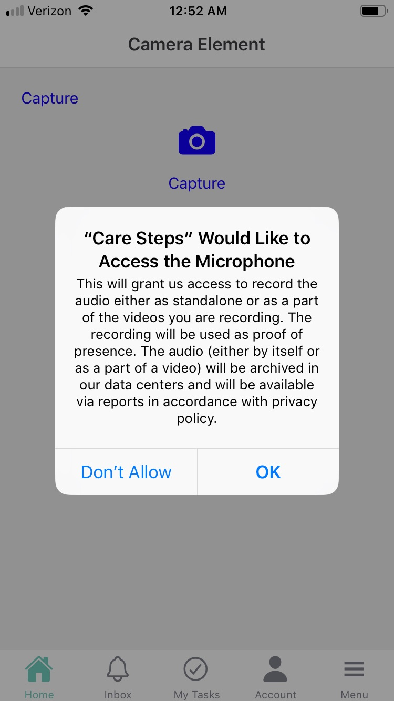
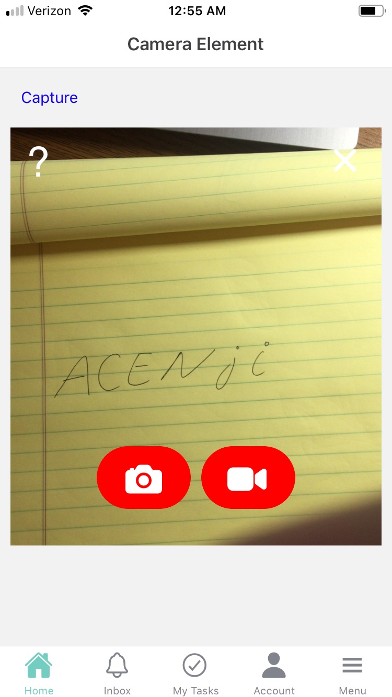
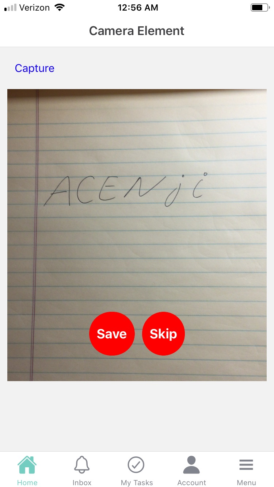
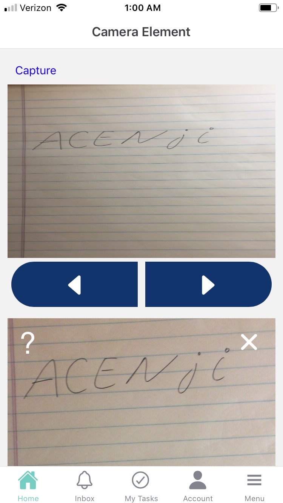

# Camera Element

Camera elements can be used for both **Forms** and **Cards**. Users can take multiple **Images** or take short **Videos**

It comes with the following attributes

- **Question Text** - Freestyle, multiline text. The text field is read-only. The text indicates to the end-user what action will follow if they press the button.
- **Optional** - Indicate if this element is mandatory to be filled in at run time. By default, this is not selected and therefore the element is mandatory.
- **Multiple** - By default is selected. indicates that multiple pictures or videos can be taken.
- **Slider Mode** - By default is selected. Indicates that images/videos appear in a single box and the user can navigate left and right to see others.
- **Access to the Camera** -

Images and videos are stored with a fully accessible static URL that is provided later in reports.
Video lengths are limited to 15 sec.

When the app is opened, the user is presented with two requests: one for access to the camera and the second for the microphone.

Questions?    <a href="https://www.acenji.com/contact" target="_blank" rel="noopener">Reach us for questions</a>   or <a href="https://github.com/acenji/acenji-help/issues" target="_blank" rel="noopener">post an issue here</a>
 

