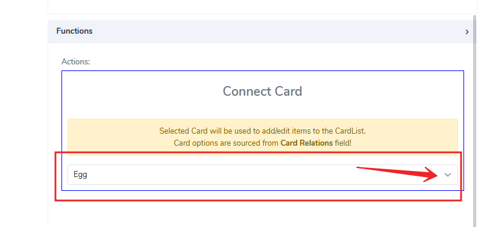

# Card Link Element

Card Link elements can be used only for **Cards** and not for **Forms**. They are similar to what URL is for the interna=et, except they navigate to another card that opens on the screen when the Card Link element is clicked.

It comes with the following attributes

- **Card Relation** - Specifies which cards this link can be open to. That attribute is located under Cards Project details

- **Action Name** - Freestyle, multiline text. The text field is read-only. The text indicates to the end-user what action will follow if they press the button.
- **Element Size** - This field is empty by default. Users can add a numerical number here to indicate in pixels the size of the button. The lower the size, the smaller the button size is a box on the canvas.
- **Inline** - Handy feature, where if selected, the element gets glued to the previous element on the canvas. If there is no space to be added to the previous element, it positions itself with its own dimensions at the beginning of the canvas on the row where is located and the next element can be glued to it.
- **Functions** - There is only one function available right now for Card Link and that is to connect to another card. Here the user specifies which card from the ones that are available to connect is to be selected.  

and finally, the actual link looks like this in the mobile app:

Questions?    <a href="https://www.acenji.com/contact" target="_blank" rel="noopener">Reach us for questions</a>   or <a href="https://github.com/acenji/acenji-help/issues" target="_blank" rel="noopener">post an issue here</a>

