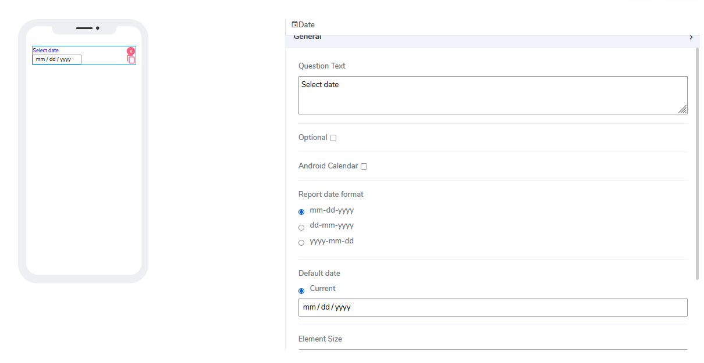
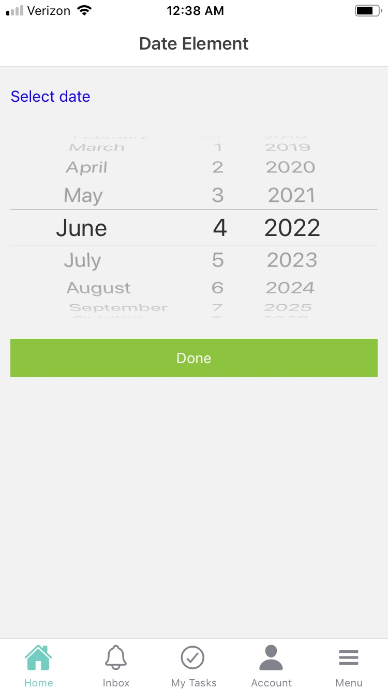

# Date Element

Checkbox elements can be used for both **Forms** and **Cards**. Users are very much familiar with so-called "check boxes" and how data is selected or deselected.

It comes with the following attributes

- **Question Text** - Freestyle, multiline text. The text field is read-only. The text indicates to end-user what information they need to add an input.
- **Optional** - Indicate if this element is mandatory to be filled in at run time. By default, this is not selected and therefore the element is mandatory.
- **Android Calendar** - This is an additional style date calendar
- **Report Date Format** - User can choose from three calendar date formats: **mm-dd-yyyy**, **dd-mm-yyyy**, and **yy-mm-dd**
- **Default Date** - By default this atribute selects current date.User can ovewrite it using mm/dd/yyyy as input value.
- **Element Size** - This field is empty by default. Users can add a numerical number here to indicate in pixels the size of the info message. The lower the size, the more lines are allocated to the text in order to define that size as a box on the canvas.

Questions?    <a href="https://www.acenji.com/contact" target="_blank" rel="noopener">Reach us for questions</a>   or <a href="https://github.com/acenji/acenji-help/issues" target="_blank" rel="noopener">post an issue here</a>

