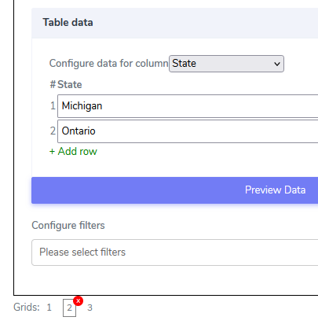

# Drill Down Grid Element

Drill Down Grid elements can be used only in **Cards**. They are rich multicolumn row-based grid systems that allow multiple grid systems to be hooked together based on the child-parent relationships. All basic functionality from the [Filter Grid](../../tutorials/cards/elements/filter-grid/index.md) applies here as well plus additional attributes. For example, Let's construct a use case for Drill Down Grid to show some of its capabilities. Let's show World countries with their annual budgets and some other statistical data. Then if the user clicks on one country, we can break down and show the regions/states of that country with their budgets and their statistics. And finally, let third grid-down that will have a rich text editor page with some bullet points, and the ability to send that information as a flat via email on the spot.

It comes with the following attributes

- **Question Text** - Freestyle, multiline text. The text field is read-only. The text indicates to the end-user what action will follow if they press the button.
- **Optional** - Indicate if this element is mandatory to be filled in at run time. By default, this is not selected and therefore the element is mandatory.
- **Configure columns** - Provides the ability to preload the columns and supply the row cells. In our example the first top grid will look like that:

What is important here is to designate one of the columns to be a link to the next grid. In our case that is Country.

Our second grid structure will be

Here we designate column **State** to be the link between this grid and next

And our last Grid system will be

- **Table Data** - This is where cells are populated with data. In the example, we populate the table with actual data.
in our example we have three grids connected together in a chain, therefore we have to populate all three with data. For simplicity, we will only populate a few rows to demonstrate the capabilities of the system.

For **Grid 1** - for the world countries we will add the following data:

For **Grid 2** -  we will add the following one state for each US and Canada:

and for **Grid 3** -  we will add the following data:

It is important to notice that when the email is used, files can be specified to be attached to that email.

- **Configure filters** - set which columns can be filtered on what data.

When loaded the grid seems naturally presented in the mobile canvas

Questions?    <a href="https://www.acenji.com/contact" target="_blank" rel="noopener">Reach us for questions</a>   or <a href="https://github.com/acenji/acenji-help/issues" target="_blank" rel="noopener">post an issue here</a>

