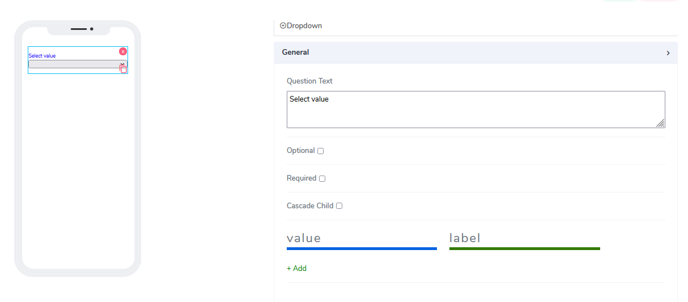
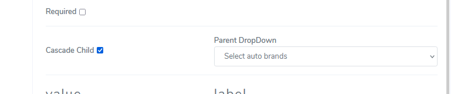
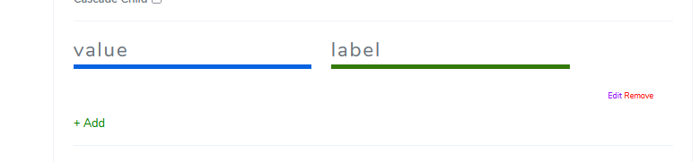
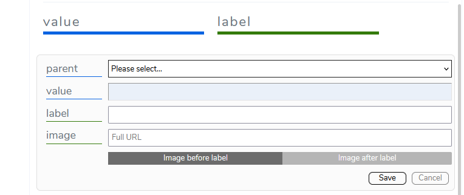
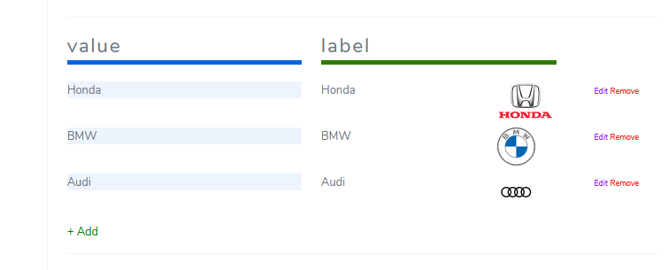
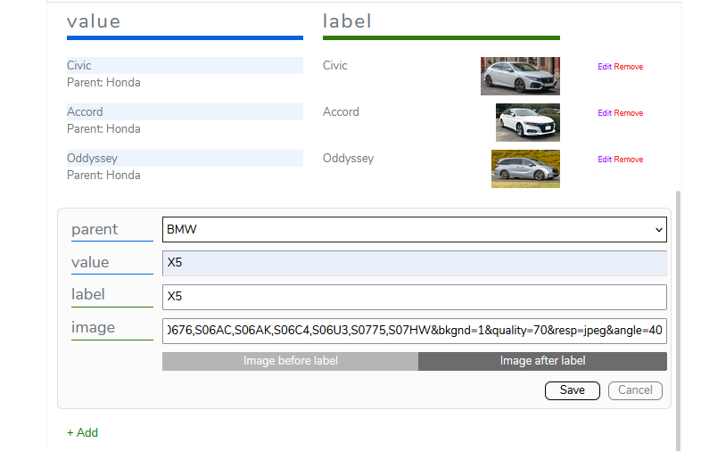
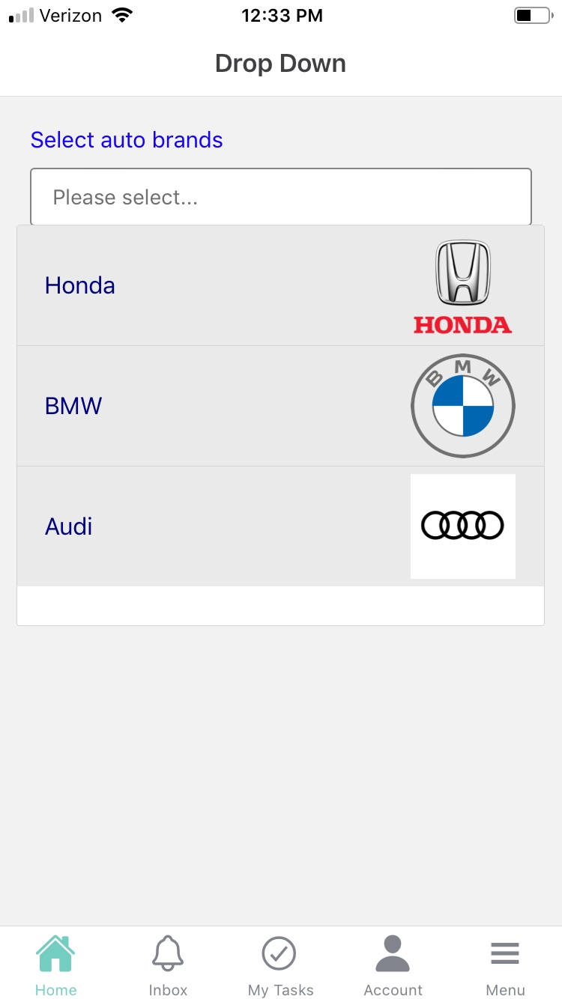
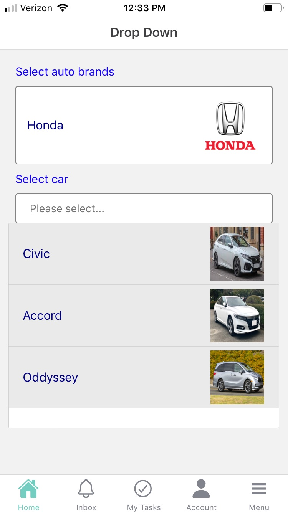
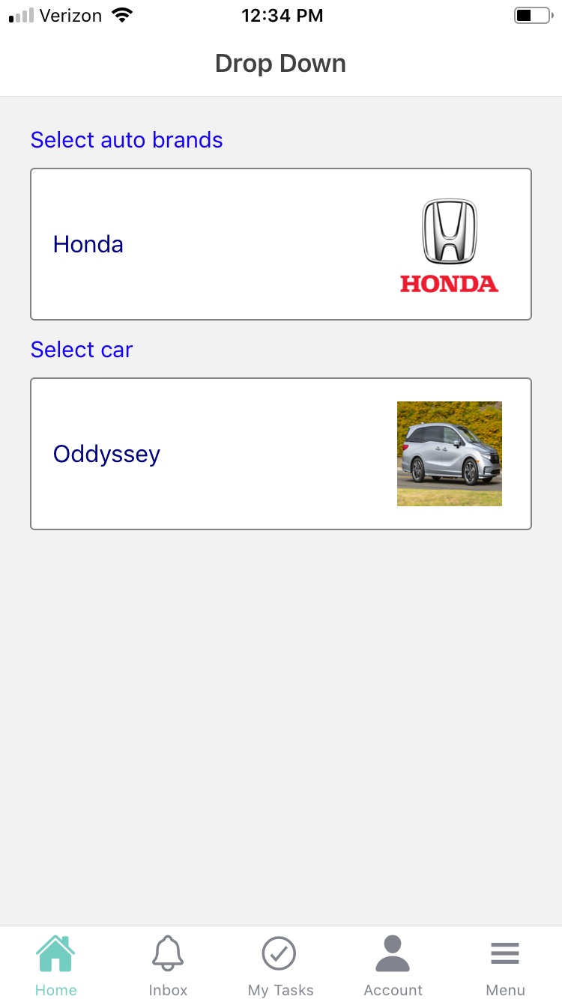
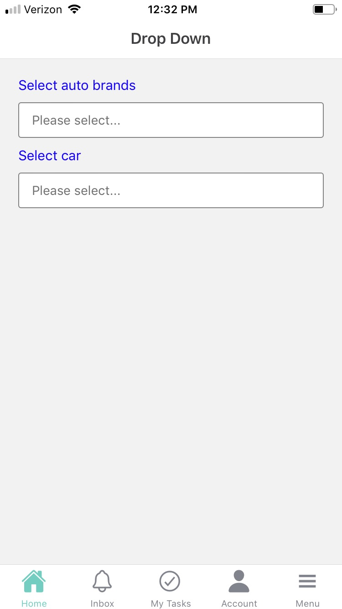

# Dropdown Element

Dropdown elements can be used for both **Forms** and **Cards**. For cards, they have richer attributes and more functionalities. In the simplest way, a dropdown gives the user to select some value from a set of values.

It comes with the following attributes

- **Question Text** - Freestyle, multiline text. The text field is read-only. The text indicates to the end-user what action will follow if they press the button..
- **Optional** - Indicate if this element is mandatory to be filled in at run time. By default, this is not selected and therefore the element is mandatory.
- **Required** - Provides the ability to preload emails that later can be selected if wanted.
- **Cascade Child** - Provides the ability to implement infinite cascaded dropdown selections, where the parent selection defines what the child selection is.

- **Add value and label** - Provides the ability to preload the values for the drop-down and their labels and images if available.

Click edit and that opens a simple form that gives the user the ability to finalize the choice for value, label, and an image(this is optional)

Let's dive into the cascaded dropdown option by filling the second dropdown. In the example, we will populate all three auto brands Honda, BMW, and Audi with some models

The actual mobile app looks familiar to a normal cascaded drop-down set

Questions?    <a href="https://www.acenji.com/contact" target="_blank" rel="noopener">Reach us for questions</a>   or <a href="https://github.com/acenji/acenji-help/issues" target="_blank" rel="noopener">post an issue here</a>

