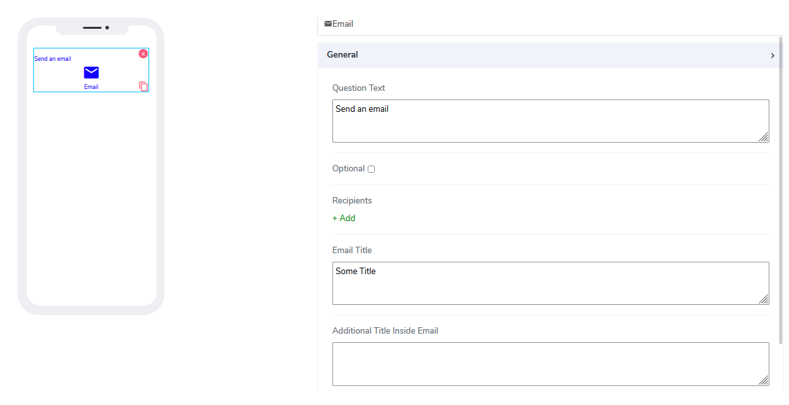
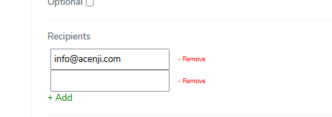
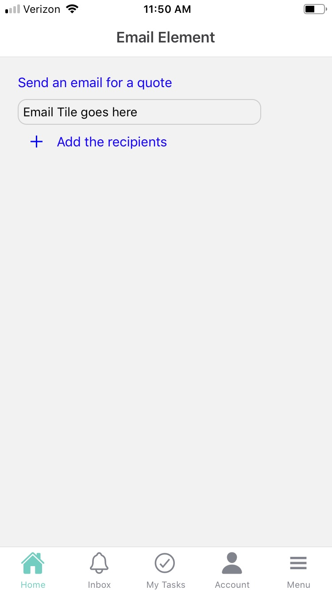
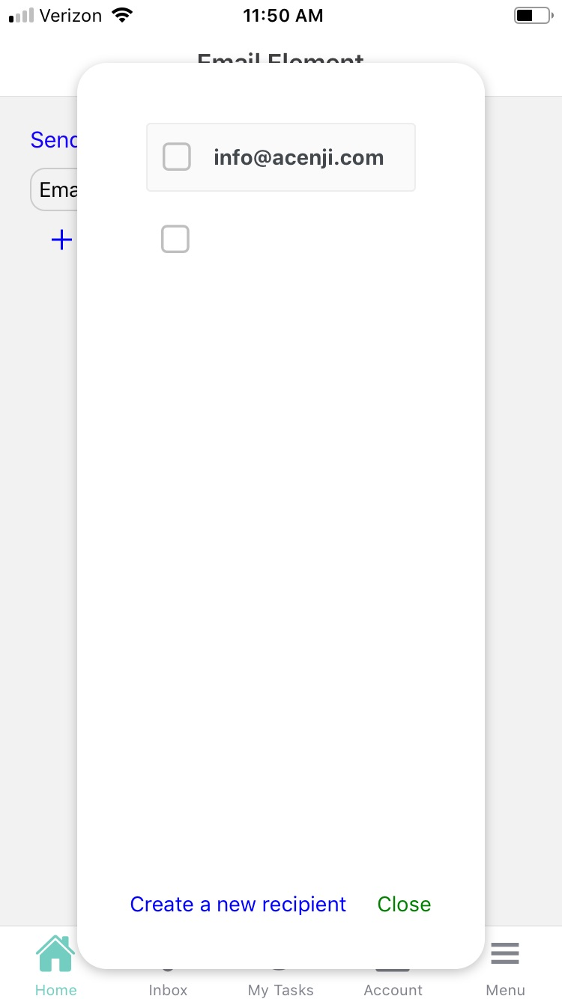
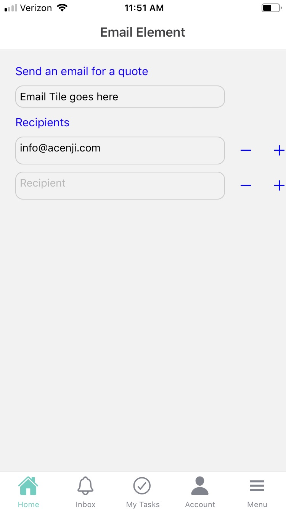

# Email Element

Email elements can be used for both **Forms** and **Cards**. It simply gives the user the ability to send an email in run time with a few options: preloaded emails, access to the contact library to extract an email, or type it.  

It comes with the following attributes

- **Question Text** - Freestyle, multiline text. The text field is read-only. The text indicates to the end-user what action will follow if they press the button..
- **Optional** - Indicate if this element is mandatory to be filled in at run time. By default, this is not selected and therefore the element is mandatory.
- **Add Recipients** - Provides the ability to preload emails that later can be selected if wanted.

- **Email Title** - Provides the ability for the user to specify the email title in advance.
- **Additional title inside Email** - Provides the ability to preload additional titles inside the email.

Questions?    <a href="https://www.acenji.com/contact" target="_blank" rel="noopener">Reach us for questions</a>   or <a href="https://github.com/acenji/acenji-help/issues" target="_blank" rel="noopener">post an issue here</a>
 

