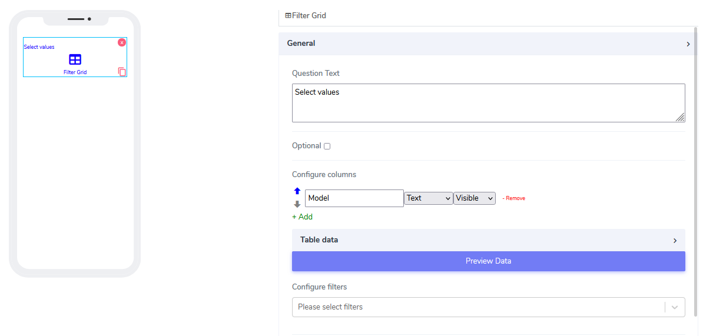
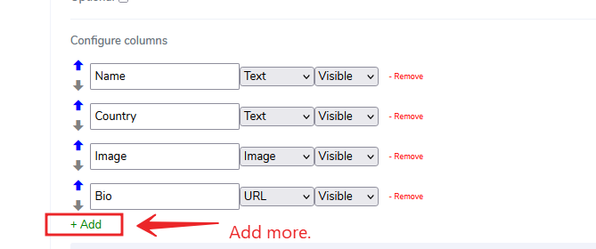
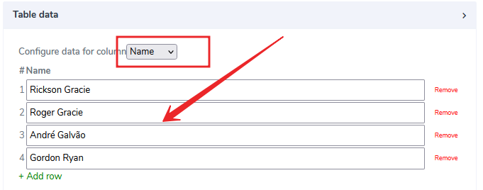
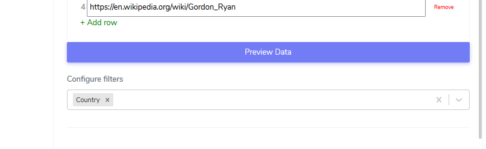
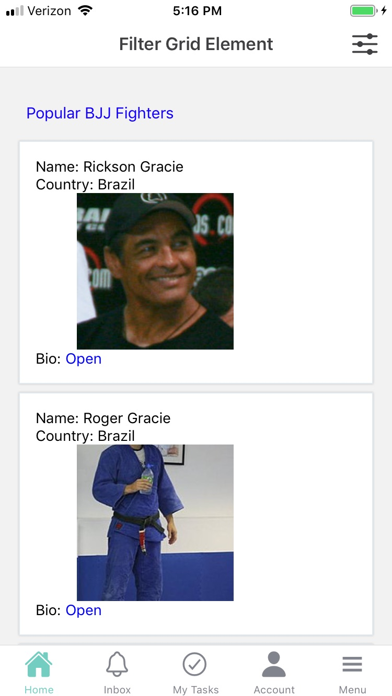
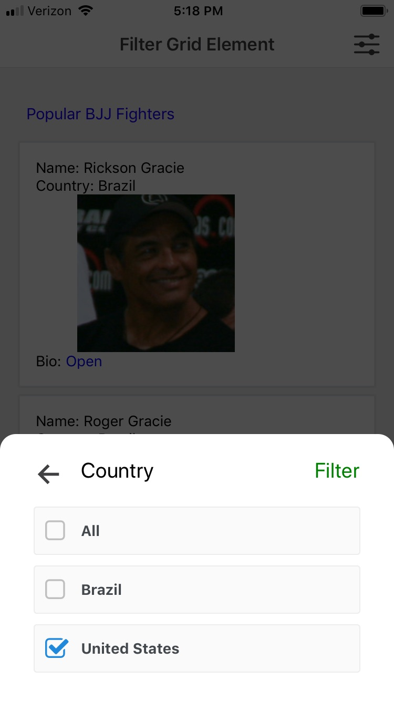

# Filter Grid Element

Filter Grid elements can be used only in **Cards**. They are rich multicolumn row-based grid system that allows multicolumn filters. Cells can handle the following types elements: Text, List,Image,URL,PDF (via URL),Quantity.

It comes with the following attributes

- **Question Text** - Freestyle, multiline text. The text field is read-only. The text indicates to the end-user what action will follow if they press the button.
- **Optional** - Indicate if this element is mandatory to be filled in at run time. By default, this is not selected and therefore the element is mandatory.
- **Configure columns** - Provides the ability to preload the columns and supply the row cells. For example, let's add to the grid some popular Brazilian Jiu-Jitsu fighters. We will add Name, Country, Image, and Bio.

   
- **Table Data** - This is where cells are populated with data. In the example, we populate the table with actual data.

- **Configure filters** - set which columns can be filtered on what data.

When loaded the grid seems naturally presented in the mobile canvas

Questions?    <a href="https://www.acenji.com/contact" target="_blank" rel="noopener">Reach us for questions</a>   or <a href="https://github.com/acenji/acenji-help/issues" target="_blank" rel="noopener">post an issue here</a>

