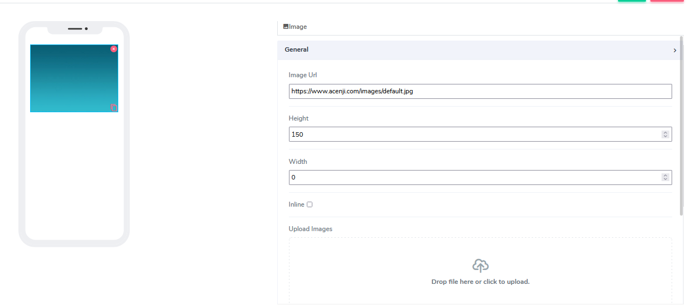
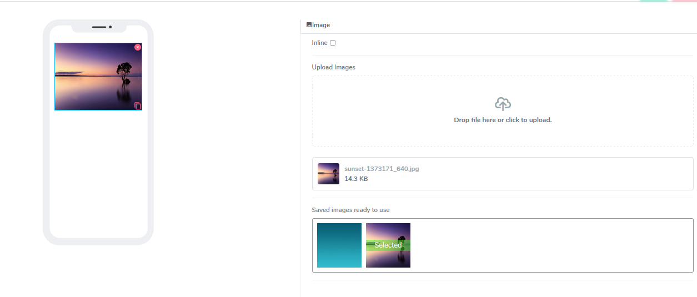

# Image Element

Image elements can be used for both **Forms** and **Cards**. Currently, images are originated as an online source with a public URL or via file upload locally to the image library.  
 

It comes with the following attributes

- **Image URL** - If the user is using a public image via URL, place it here. If a user uploads the image via a file, a URL will be generated for you  
- **Height** - This field is empty by default. Users can add a numerical number here to indicate in pixels the height of the image.
- **Width** -  This field is empty by default. Users can add a numerical number here to indicate in pixels the width of the image.
- **Inline** - Handy feature, where if selected, the element gets glued to the previous element on the canvas. If there is no space to be added to the previous element, it positions itself with its own dimensions at the beginning of the canvas on the row where is located and the next element can be glued to it.
- **Upload Image** - In case the user wants to use an internal, non URL sourced image, the system allows for image upload. Drag an image file or just browse and upload one. The user sees all selected media files for the current project that are available and selects the chosen one by clicking on the image from the media library. That automatically creates a public URL in the URL field.

Questions?    <a href="https://www.acenji.com/contact" target="_blank" rel="noopener">Reach us for questions</a>   or <a href="https://github.com/acenji/acenji-help/issues" target="_blank" rel="noopener">post an issue here</a>

