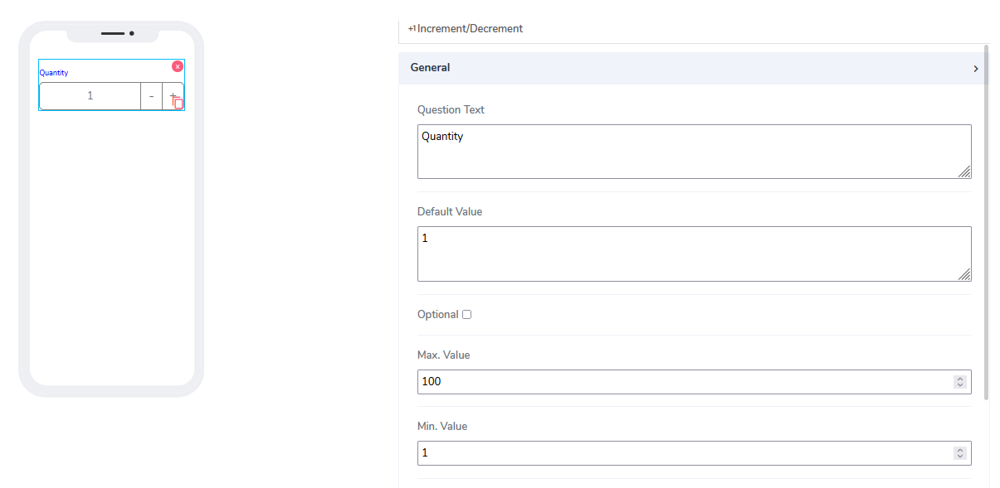
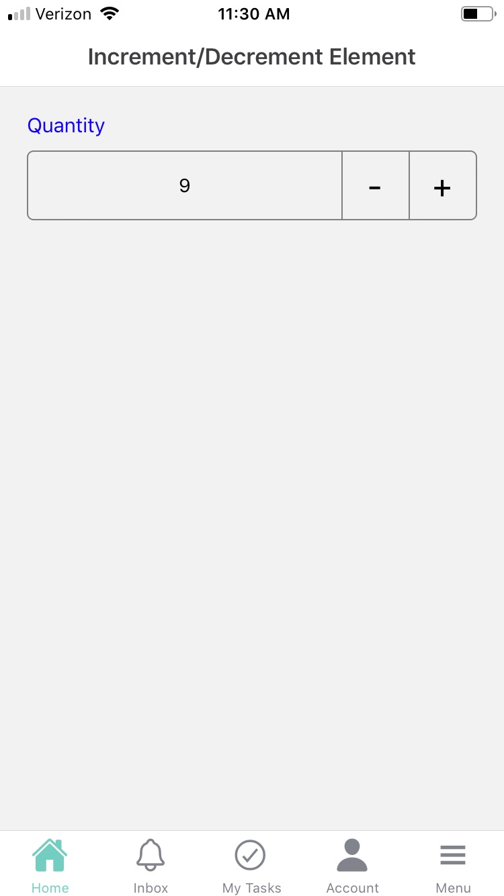

# Increment/Decrement Element

Increment/Decrement elements can be used for both **Forms** and **Cards**. The idea is to click and increase or decrease the current value presented to them. Often is used for shopping carts or an inventory count.

It comes with the following attributes

- **Question Text** - Freestyle, multiline text. The text field is read-only. The text indicates to end-user what information they need to add an input.
- **Default Value** - By default this element comes as an optional. Information can be placed here at design time. A default value of 1 is assigned to help the user what this represents as a hint.
- **Optional** - Indicate if this element is mandatory to be filled in at run time. By default, this is not selected and therefore the element is mandatory.
- **Min Value** - Indicates what is the starting point for the slider to be represented visually to the user.
- **Max Value** - Indicates what is the ending point for the slider to be represented visually to the user.
- **Step Value** - Indicates when one unit is moved by the slider what that unit(step) is in value. The default value of 1 is assigned.

Questions?    <a href="https://www.acenji.com/contact" target="_blank" rel="noopener">Reach us for questions</a>   or <a href="https://github.com/acenji/acenji-help/issues" target="_blank" rel="noopener">post an issue here</a>

