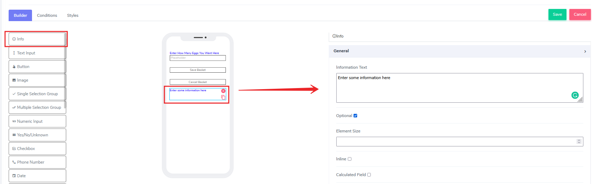
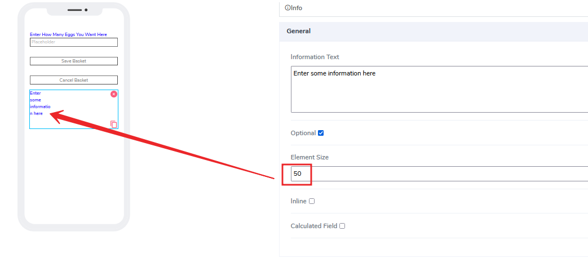
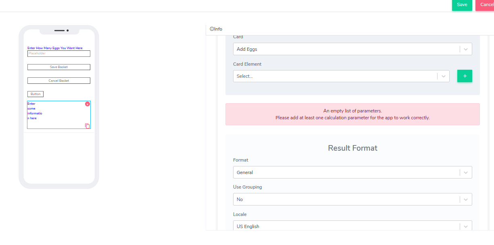
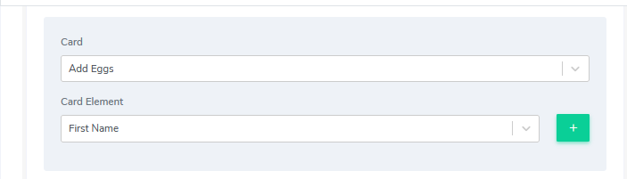
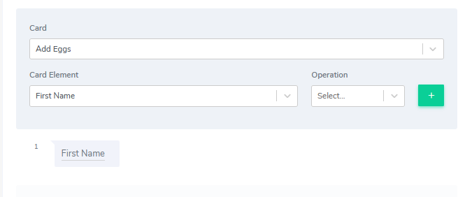
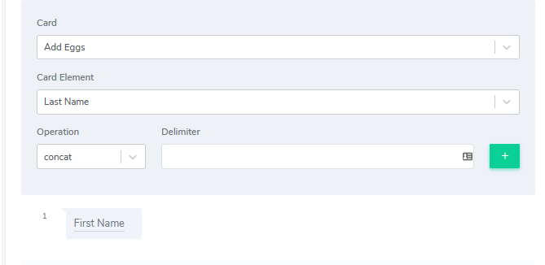
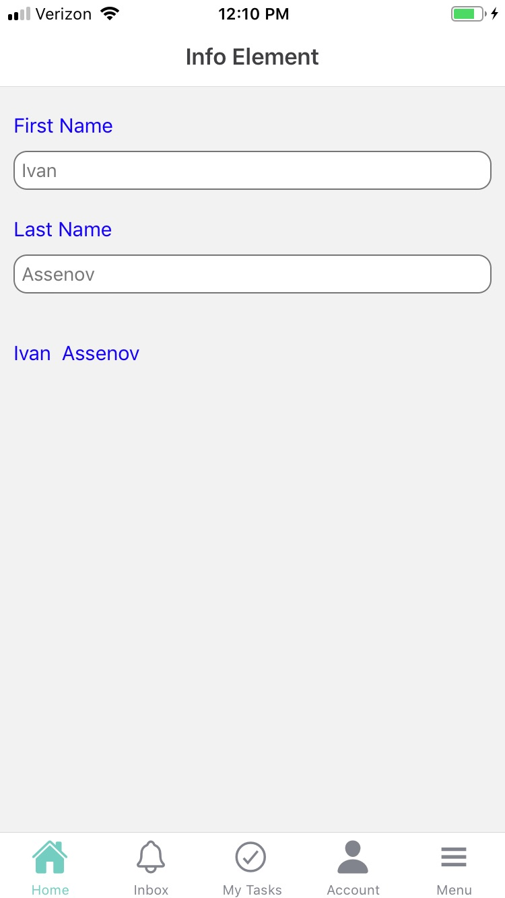
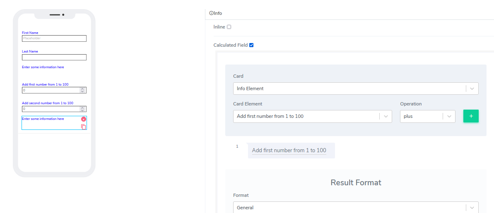
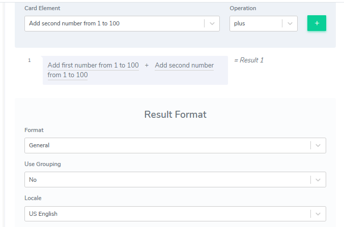

# Info Element

Info elements can be used for both Forms and Cards. It is probably one of the simplest elements ACENji offers as a building block.

It comes with the following attributes

- **Information Text** - Freestyle, multiline text. The text field is read-only. Information can be placed here at design time or at run time via the calculated field function (see below).
- **Optional** - By default this element comes as an optional.  
- **Element Size** - This field is empty by default. Users can add a numerical number here to indicate in pixels the size of the info message. The lower the size, the more lines are allocated to the text in order to define that size as a box on the canvas.

- **Inline** - Handy feature, where if selected the element gets glued to the previous element on the canvas. If there is no space to be added to the previous element, it positions itself with its own dimensions at the beginning of the canvas on the row where is located and the next element can be glued to it.

- **Calculated Field** - By default this is not selected. If the user selects that option, the following image will open:

The idea here is to concatenate complex calculations using either input information from the same or other cards. For example, Add two text fields on the same card for simplicity: First Name and Last Name. End result will be to display both names together inside the info element using the calculation field set up.
Select the card element First name and click the green + button

Next, we will select the selected element we want to participate in the calculation: Last Name. Using the same drop-down where currently is selected First Name, change it to last Name and this time select Operation. The following operations are present:
-- Plus
-- Minus
-- Multiply
-- Divide
-- Concat

For our example, select "concat". That will concatenate the value from the First name and the value from the last name together as result. A new field will show up called "Delimiter". Because we indicated we will do concatenation on two values as string tokens, we need to also tell the platform how these two tokens will be glued together. For our example, let's add empty space two times, so the result will be "First  Last".

Click the green "+" button again. That will create our first result. The idea is to have as many results here as we want, all connected via some type of operation. Because different cards and different fields can participate in the calculation efforts, the final result could be very complex calculation sets.
In addition, the calculation field is actually populated immediately as the data comes in. So, for example, as long the user adds the first name as input, the info field will display it. Then when a user adds the second part of the concatenated calculation (last name) that will be added.

The resulted format section has to do with then we display numbers. For example, let's calculate two numbers as addition and assign them in currency format.
We will reuse the last card and add three additional elements: two input numeric number elements and one info element to show the result.

This time select "plus" from the operation and add the second number.

Let's add formating. We will choose the "Currency symbol".

We also can take advantage of the "Use Grouping" option and select "Locale" to indicate the supported language region. By default, we support US English.

Questions?    <a href="https://www.acenji.com/contact" target="_blank" rel="noopener">Reach us for questions</a>   or <a href="https://github.com/acenji/acenji-help/issues" target="_blank" rel="noopener">post an issue here</a>

 

 

