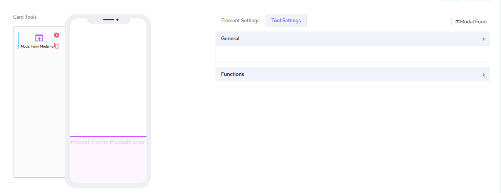
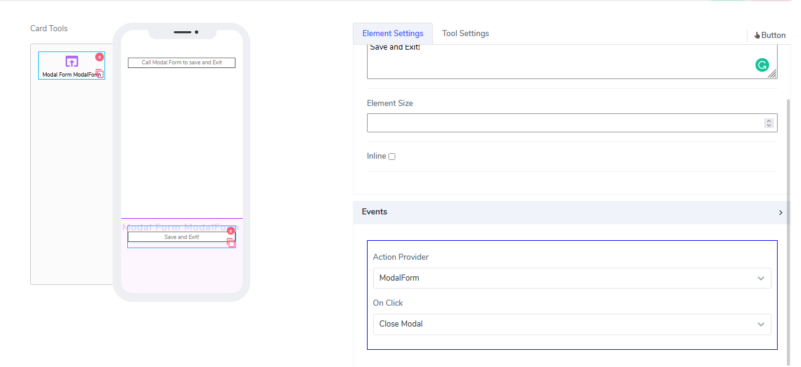
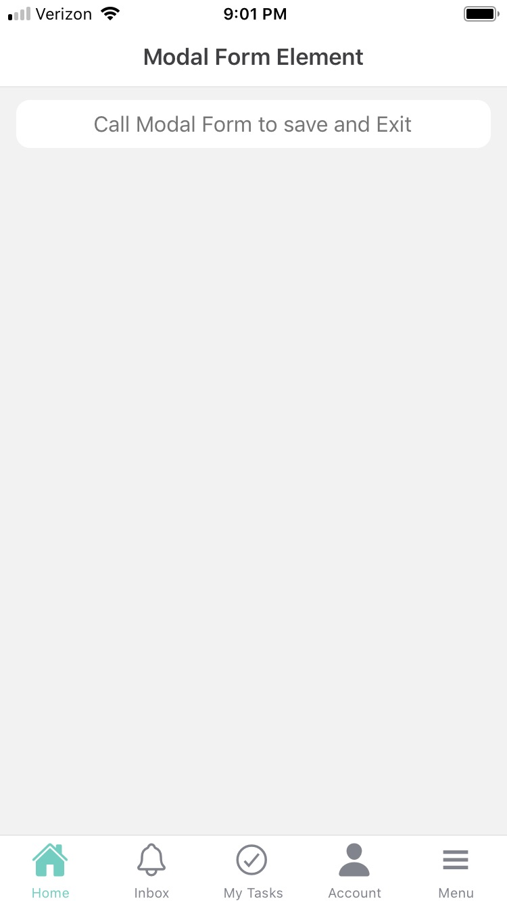
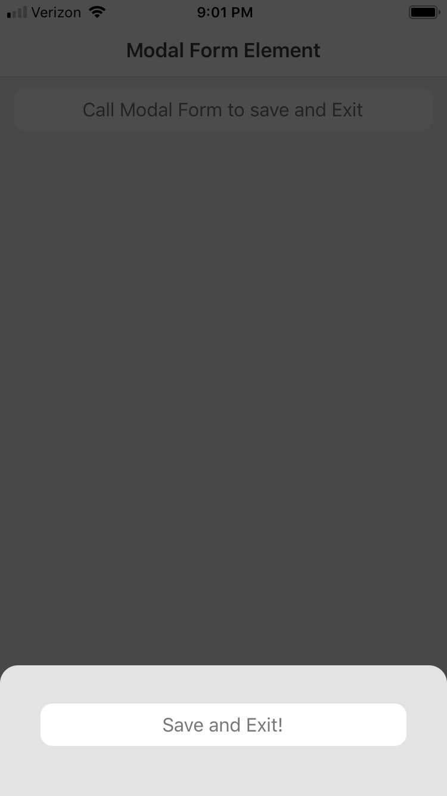

# Modal Form Element

Modal Form elements can be used in **Cards**. For cards, they have a simple role: to act as a container for a modal "window" that opens on top of the existing canvas.
An example could be opening a window that asks the user to save or not to save.

It comes with the following attributes

- **Action Provider** - This attribute is actually not visible at the element level but at the element that invokes the modal form.
For example, if we drop a button inside the canvas and on **Events** select Action Provider as "ModalForm", Next we specify on click to open the modal form.
Inside the actual modal form, we could have another element that lets us do something. Let's add a save and exit button there

Questions?    <a href="https://www.acenji.com/contact" target="_blank" rel="noopener">Reach us for questions</a>   or <a href="https://github.com/acenji/acenji-help/issues" target="_blank" rel="noopener">post an issue here</a>

