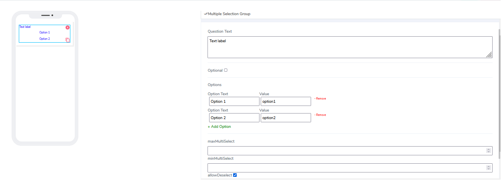
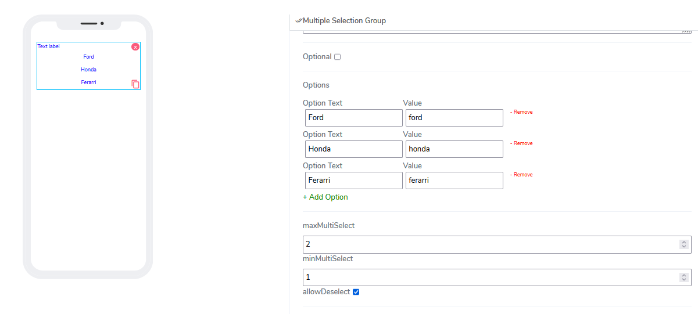
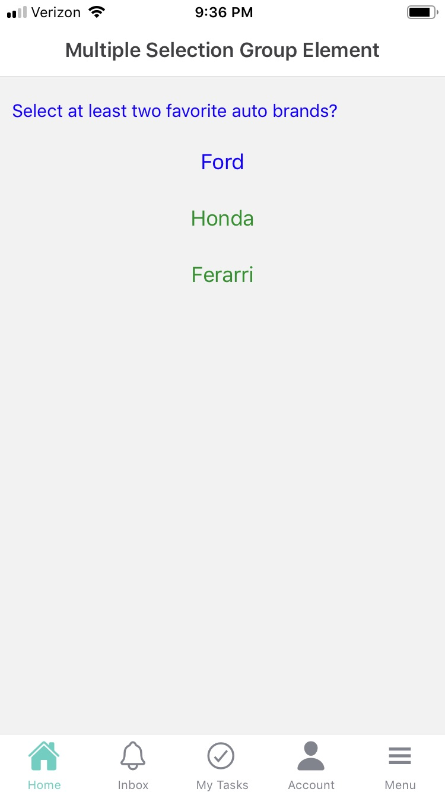

# Multiple Selection Group Element

Multiple Selection Group elements can be used for both **Forms** and **Cards**. Users can choose to select one, two, or more out of many available items from a collection of predefined items.

It comes with the following attributes

- **Question Text** - Freestyle, multiline text. The text field is read-only. The text indicates to the end-user what action will follow if they press the button.
- **Optional** - Indicate if this element is mandatory to be filled in at run time. By default, this is not selected and therefore the element is mandatory.
- **Options** - By default the program will add one item with Option Text and option value. Users can add more after that. The **Option Text** is the text that will be displayed and **Option value** is the value the system will use for any internal communications. It is ok the pair to be the same or different.

- **MaxMultiSelect** - Defines how many items **CAN** be maximum selected at the same time from the item collection.
- **minMultiSelect** - Defines how many items **MUST** be minimum selected at the same time from the item collection.
- **Allow Deselect** - By default this option is auto-selected. If gives the user an opportunity after a selection is done to revert it.  

Questions?    <a href="https://www.acenji.com/contact" target="_blank" rel="noopener">Reach us for questions</a>   or <a href="https://github.com/acenji/acenji-help/issues" target="_blank" rel="noopener">post an issue here</a>

