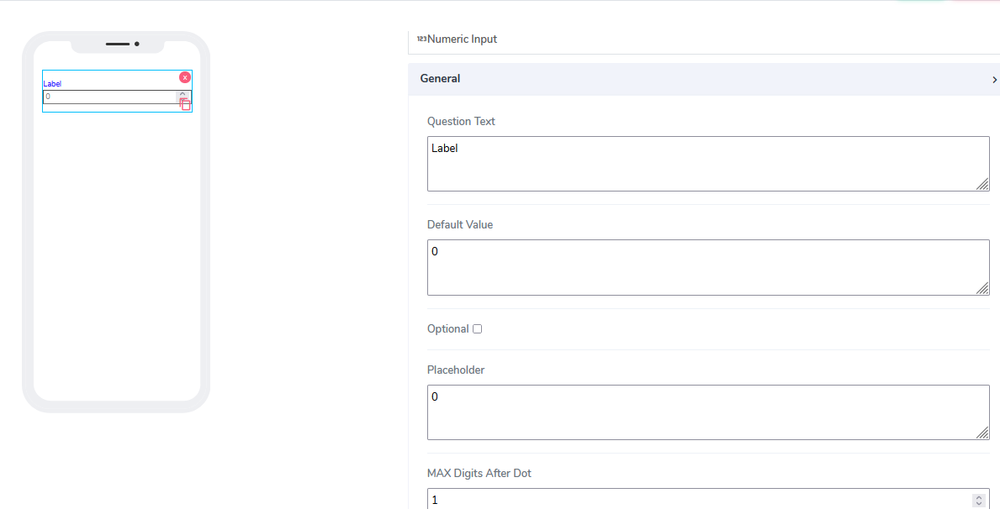
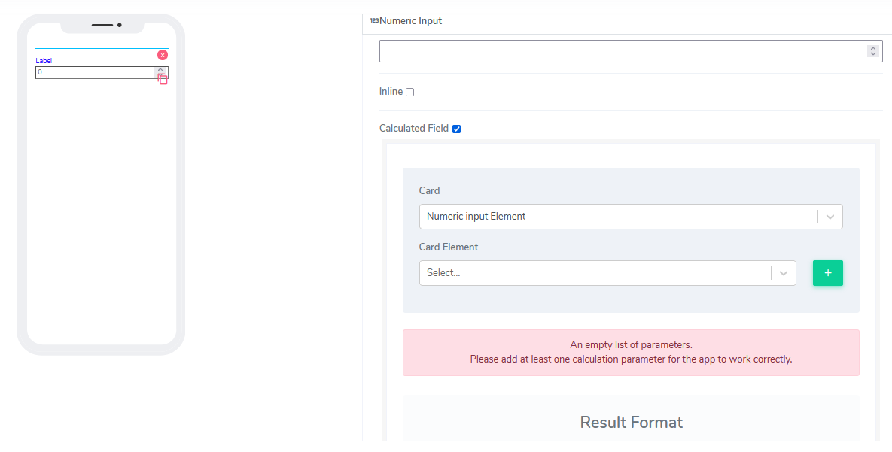

# Numeric input Element

Numeric Input elements can be used for both **Forms** and **Cards**. Users are very much familiar with so-called "text boxes" and how data is entered. The big difference here is that they can enter only numbers with different formats.

It comes with the following attributes:

- **Question Text** - Freestyle, multiline text. The text field is read-only. The text indicates to end-user what information they need to add an input.
- **Default Value** - By default this element comes as an optional. Information can be placed here at design time or at run time via the calculated field function (see below). value of 0 (zero) is assigned.
- **Optional** - Indicate if this element is mandatory to be filled in at run time. By default, this is not selected and therefore the element is mandatory.
- **Placeholder** - This is used as a hint to specify an expected value in the input box. If clean, nothing will display. By default, a value of 0 (zero) is assigned.
- **Max Digits after Dot** - The user can put restrictions on how many digits to be allowed after the decimal dot.
- **Allow Decimal** - If selected, the combination of **Max Digits after Dot** creates the ability for decimal numbers to be displayed or entered.
- **Element Size** - This field is empty by default. Users can add a numerical number here to indicate in pixels the size of the info message. The lower the size, the more lines are allocated to the text in order to define that size as a box on the canvas.
- **Inline** - Handy feature, where if selected the element gets glued to the previous element on the canvas. If there is no space to be added to the previous element, it positions itself with its own dimensions at the beginning of the canvas on the row where is located and the next element can be glued to it.
- **Calculated Field** - By default this is not selected. If the user selects that option, the following image will open:

Calculated field for Numeric element is identical to how works as [Info element](../../tutorials/cards/elements/info/index.md).

Questions?    <a href="https://www.acenji.com/contact" target="_blank" rel="noopener">Reach us for questions</a>   or <a href="https://github.com/acenji/acenji-help/issues" target="_blank" rel="noopener">post an issue here</a>

