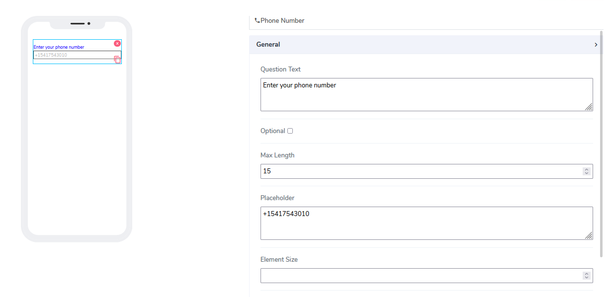

# Phone Number Element

Phone number elements can be used for both **Forms** and **Cards**. It is designated for phone numbers and codes.

It comes with the following attributes:

- **Question Text** - Freestyle, multiline text. The text field is read-only. The text indicates to end-user what information they need to add an input.
- **Optional** - Indicate if this element is mandatory to be filled in at run time. By default, this is not selected and therefore the element is mandatory.
- **max Length** - Indicates how many characters are allowed to be entered.
- **Placeholder** - This is used as a hint to specify an expected value in the input box. If clean, nothing will display. By default, a value of +15417543010 is assigned.  
- **Element Size** - This field is empty by default. Users can add a numerical number here to indicate in pixels the size of the info message. The lower the size, the more lines are allocated to the text in order to define that size as a box on the canvas.
- **Inline** - Handy feature, where if selected the element gets glued to the previous element on the canvas. If there is no space to be added to the previous element, it positions itself with its own dimensions at the beginning of the canvas on the row where is located and the next element can be glued to it.

Questions?    <a href="https://www.acenji.com/contact" target="_blank" rel="noopener">Reach us for questions</a>   or <a href="https://github.com/acenji/acenji-help/issues" target="_blank" rel="noopener">post an issue here</a>

