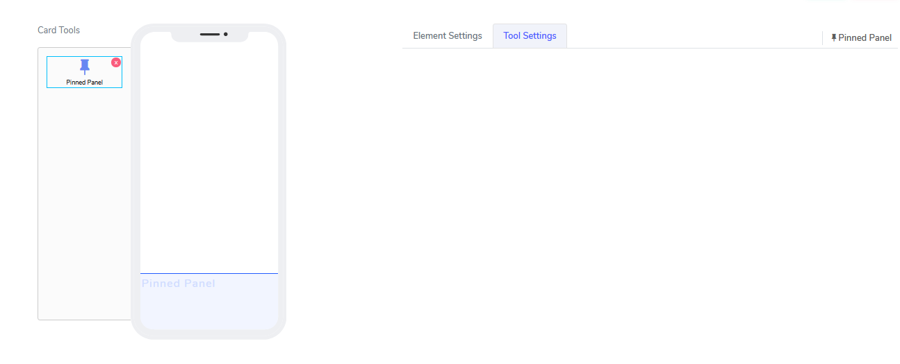
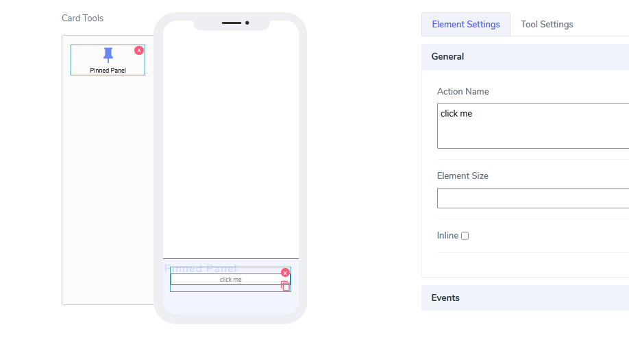
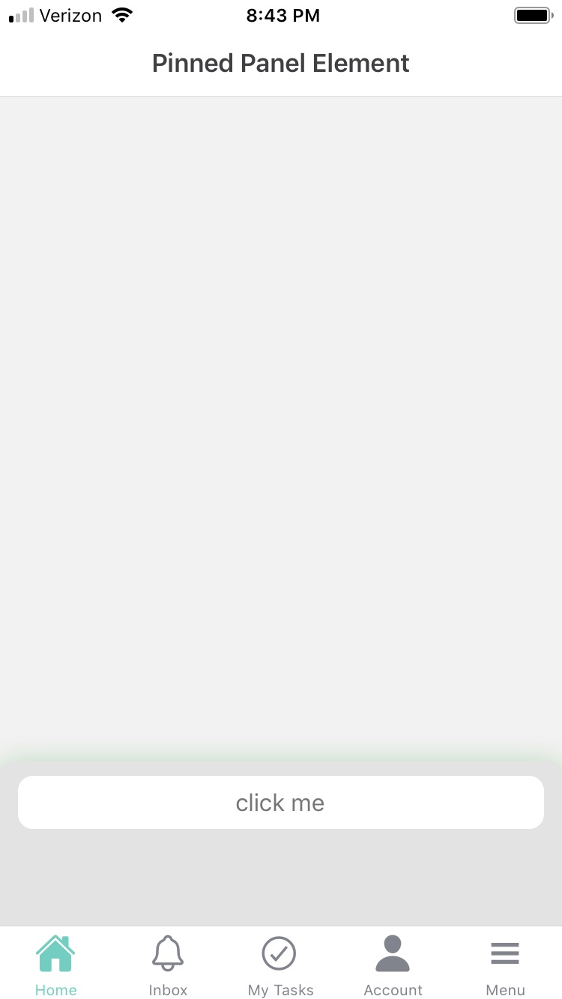

# Pinned Panel Element

Pinned Panel elements can be used only in **Cards**. The idea is very simple: they create an area that is anchored to the bottom of the canvas and accepts new elements there.

It comes with the following attributes

The element does not have visual attributes. All functionality is hidden and works out of the box. An example of a use case is to drop a button there.

Since this element is invisible, the only elements on the canvas will be those inside the pinned panel.

Questions?    <a href="https://www.acenji.com/contact" target="_blank" rel="noopener">Reach us for questions</a>   or <a href="https://github.com/acenji/acenji-help/issues" target="_blank" rel="noopener">post an issue here</a>

