# Price Table - What it is and how to use it?

How the Price table works? Before we answer that question, let's first examine what pain the price table element solves.
Imagine you have an inventory of basic food ingredients and they have prices based on volume brackets.

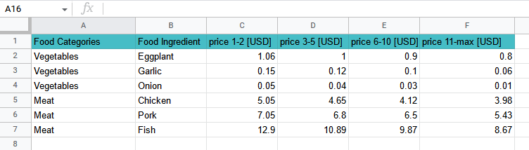

Would it be nice to have a calculator that behind the scene reads the actual prices and calculates on the fly the exact amount? Imagine this being done on a cellphone and send as a quote or even a money order. Even the most complicated prices can be accommodated within the price table no-code element by acenji. Then, in addition, you can combine it with other no-code elements and apply discounts, additional charges, and so on. The following is an example of such a price table element and how to use it.

The example is for the price range(the more complicated example), so the simplifying version will be a single price - just remove the price range. Forma start we will use several dropdowns, a quantity field, and a display price field. The final configurations look like this:

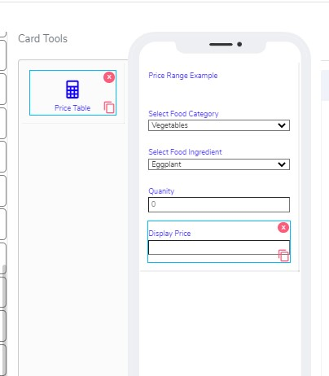

The above card example project demonstrates how the Price table works with a range of volumes

<ol>
<li>For a start, we added label info on top that is just the title</li>
<li>Then added a drop-down called Select food category</li>

<!--around the images need to have an empty line, otherwise for some reason do not display them-->

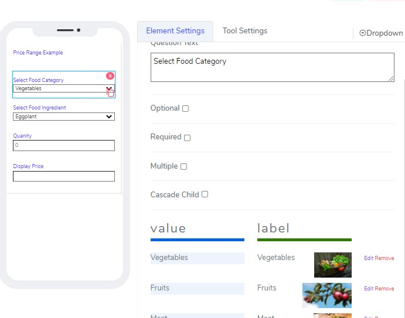

Added three categories: Vegetables, Fruits, and Meat.Here is an example :

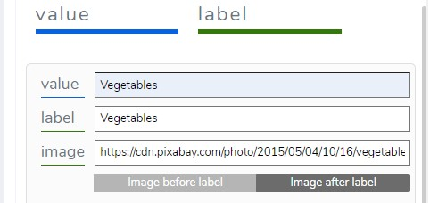

<li>Next, we added another drop-down for selecting the food ingredients</li>

There, select the Cascade Child checkbox and select &ldquo;Select food category&rdquo;

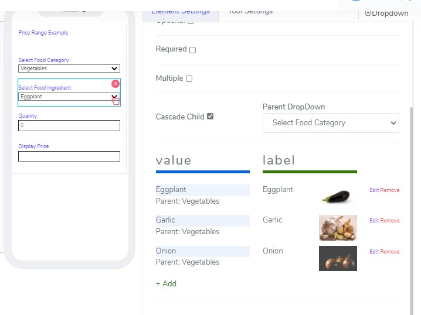

Added a few veggies. Ex.

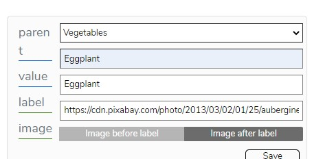

<li>Added numeric field we called the quantity&nbsp;</li>

We will use that field to tell how many items we are buying.&nbsp;

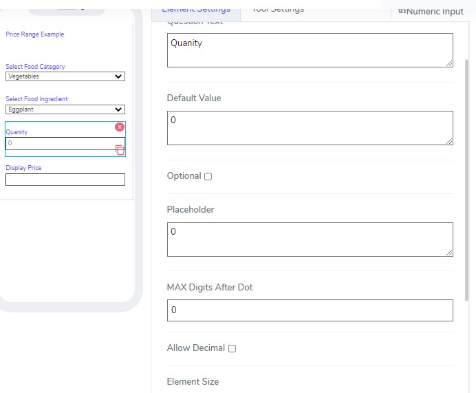

<li>Added text field called display price</li>

This field is auto-populated, no need to do anything&nbsp;

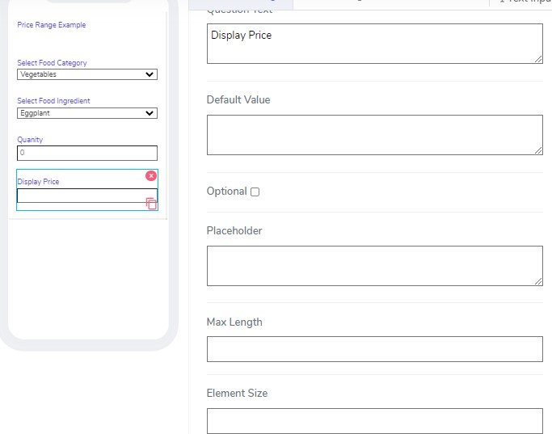

<li>Added finally price element&nbsp;</li>

The way you currently add price element is to drag it so it comes from the bottom of the cell phone a, without touching other elements

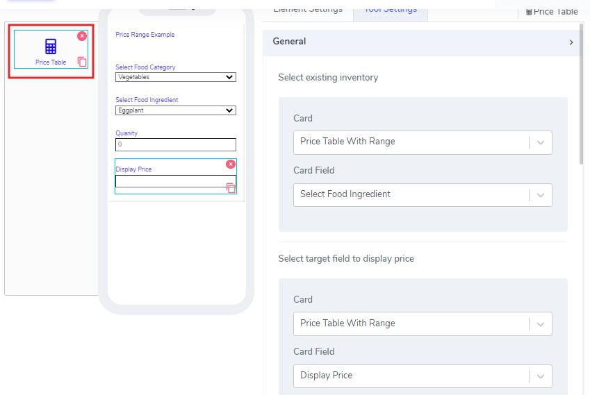

When you add that element it comes with few settings.

First, select the card and the card field you want the price to be against&nbsp;

Then select which card and field to display the price&nbsp;

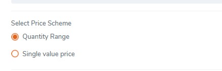

Then select a single quantity or quantity range for the price:

Quantity range means that one item can have multiple prices based on volume.For example, range 1-10 price1, 11-20-price2, etc&hellip;

Finally, select the quantity field

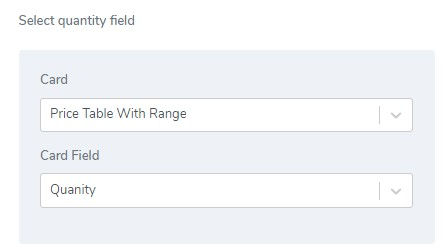

That field is could be from another card and usually is input by users at run time&nbsp;

Then you add the prices for each item. An example is eggplant prices below&nbsp;

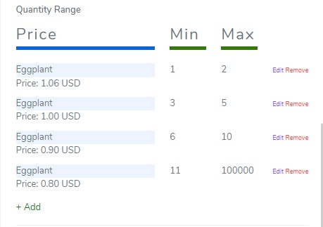

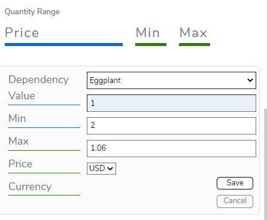

<li>Actual image from a cellphone app</li>

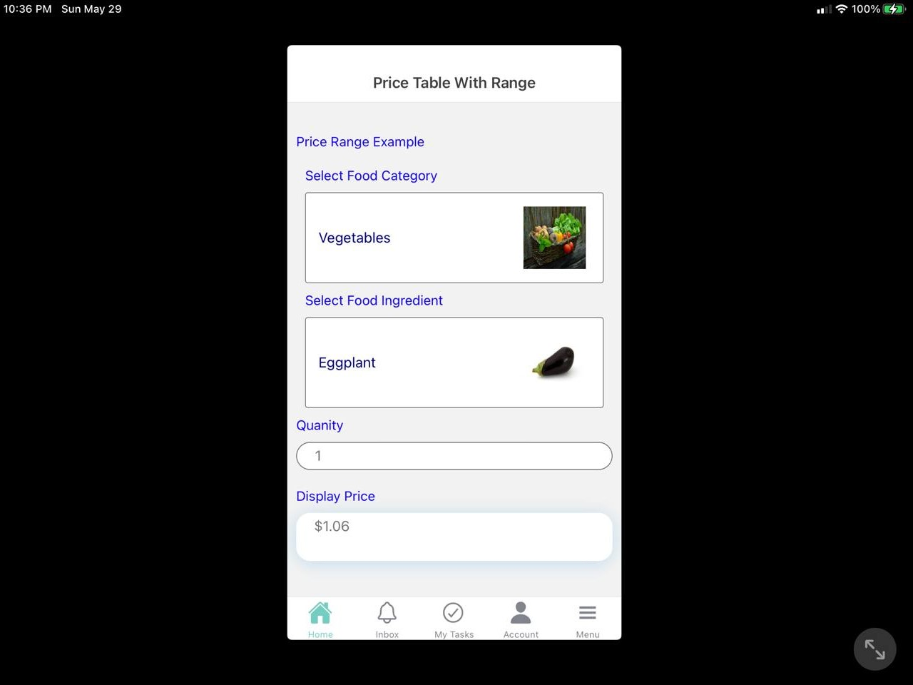

<li>Questions?    <a href="https://www.acenji.com/contact" target="_blank" rel="noopener">Reach us for questions</a>   Or   
<a href="https://github.com/acenji/acenji-help/issues" target="_blank" rel="noopener">post an issue here</a></li>
</ol>

