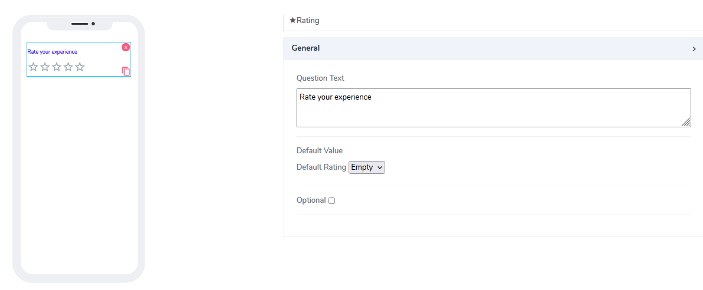
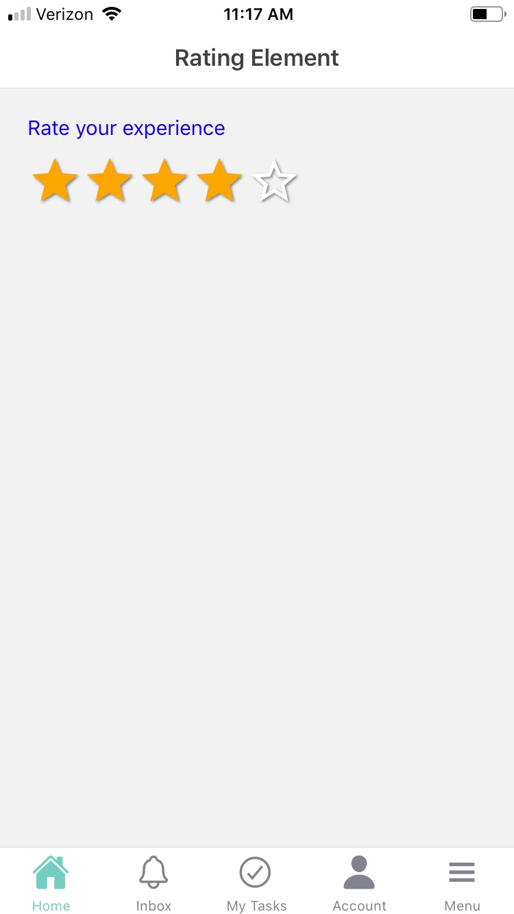

# Rating Element

Rating elements can be used for both **Forms** and **Cards**. The idea is to provide the user with the ability to rate some questions on a scale of one to 5. The actual values are represented as stars that are like buttons. If the user clicks on star number 2, the first two stars are filled to indicate the action.

It comes with the following attributes

- **Question Text** - Freestyle, multiline text. The text field is read-only. The text indicates to end-user what information they need to add an input.
- **Default Value** - By default this element comes as an optional. Information can be placed here at design time or at run time via the calculated field function (see below). The default value of empty is assigned to help the user what this represents as a hint. User can choose from empty, 1,2,3,4,5 as values.
- **Optional** - Indicate if this element is mandatory to be filled in at run time. By default, this is not selected and therefore the element is mandatory.

Questions?    <a href="https://www.acenji.com/contact" target="_blank" rel="noopener">Reach us for questions</a>   or <a href="https://github.com/acenji/acenji-help/issues" target="_blank" rel="noopener">post an issue here</a>

