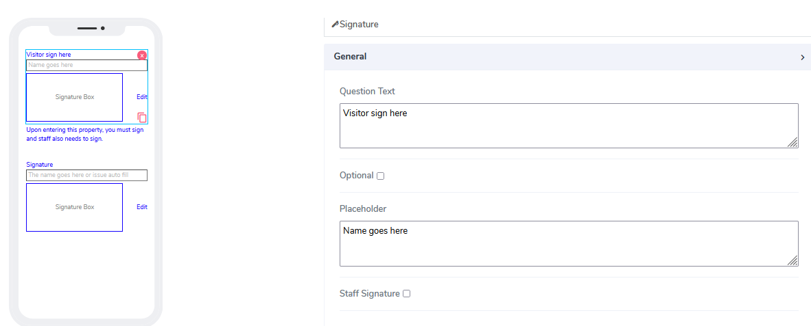
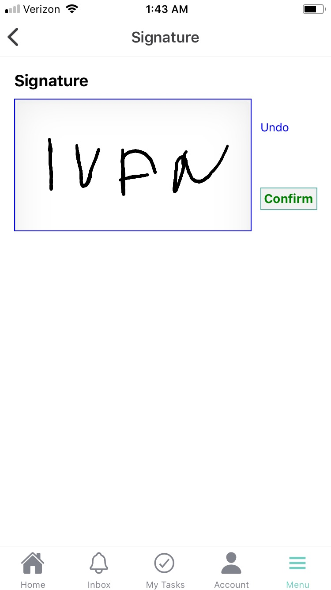
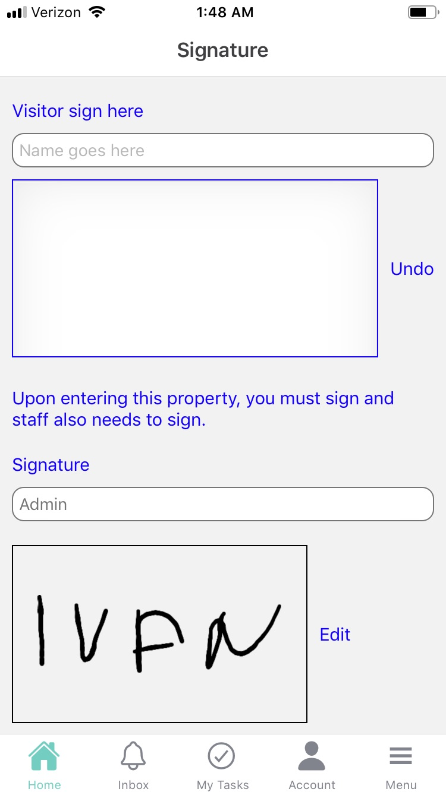

# Signature Element

Signature elements can be used for both **Forms** and **Cards**. It represents a widget combining name plus signature, authentically preserved in a ledger to prevent fraud.  

It comes with the following attributes

- **Question Text** - Freestyle, multiline text. The text field is read-only. The text indicates to end-user what information they need to add an input.
- **Optional** - Indicate if this element is mandatory to be filled in at run time. By default, this is not selected and therefore the element is mandatory.
- **Placeholder** - This is used as a hint to specify an expected value in the input box. If clean, nothing will display. By default, a value of **Placeholder** is assigned.
- **Staff Signature** - Staff users can preload their signatures and have them already apprear on the app screen. To do that go to **Menu** -> **Settings** -> **Signature** -> sign your signature here. Click **Confirm** button.

  

Questions?    <a href="https://www.acenji.com/contact" target="_blank" rel="noopener">Reach us for questions</a>   or <a href="https://github.com/acenji/acenji-help/issues" target="_blank" rel="noopener">post an issue here</a>

