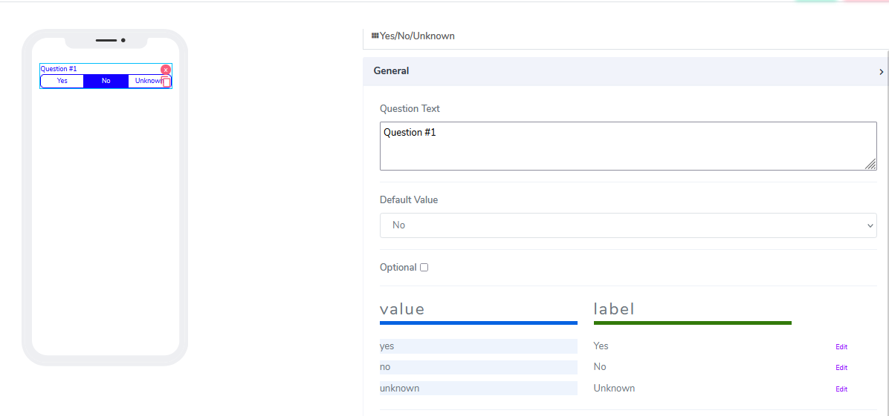
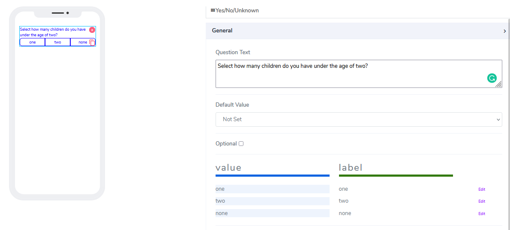
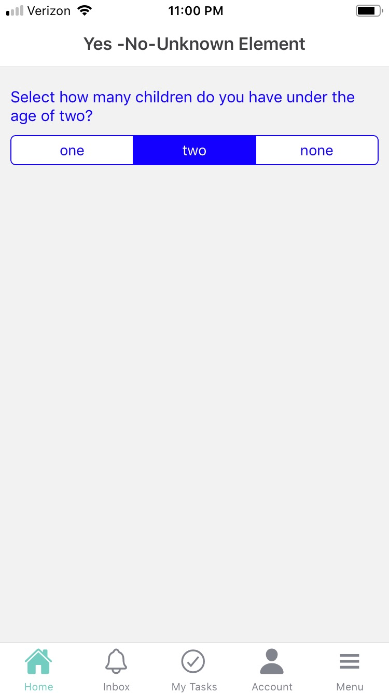

# Yes, No, Unknown Element

Yes, NO, Unknown elements can be used for both **Forms** and **Cards**. The idea is to give users a single choice from multiple sets of items but works as a radio button. Users can create an unlimited number of items as part of the set.

It comes with the following attributes

- **Question Text** - Freestyle, multiline text. The text field is read-only. The text indicates to end-user what information they need to add an input.
- **Default Value** - The user has the ability to set off of the set items as preselected.
- **Optional** - Indicate if this element is mandatory to be filled in at run time. By default, this is not selected and therefore the element is mandatory.
- **Values and Labels** - These two fields come as pair. Users can overwrite the default three values and labels. Keep in mind no deselect is allowed.

Actual implementation in mobile looks like that:

Questions?    <a href="https://www.acenji.com/contact" target="_blank" rel="noopener">Reach us for questions</a>   or <a href="https://github.com/acenji/acenji-help/issues" target="_blank" rel="noopener">post an issue here</a>

