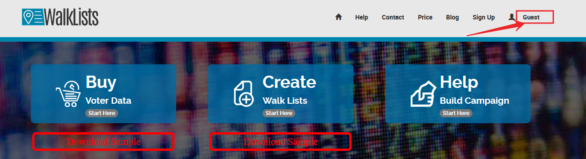
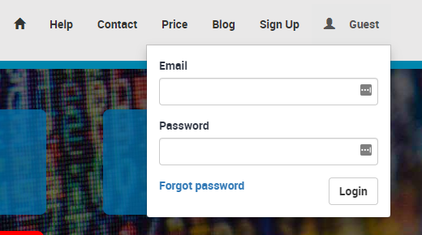
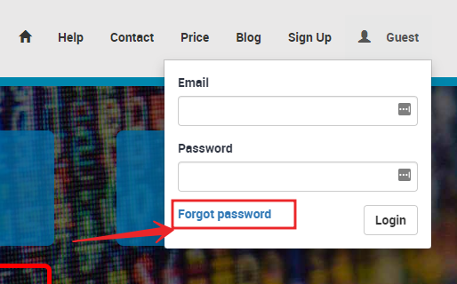
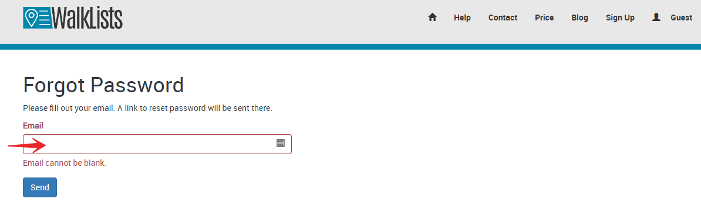
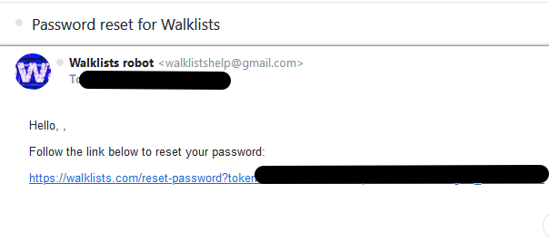
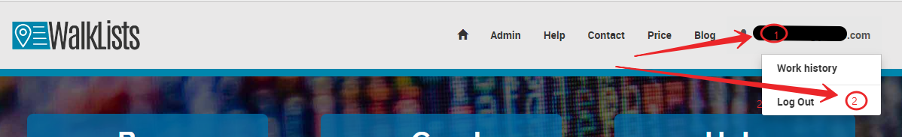

# Login, Logout, Forgot Password for WalkLists

To log in user simply clicks on the Guest menu link.

Then fill-in in the form information and click the Login button. 

 If a user forgets his/hers password, click on the reset link.

A new form opens. Fill in user's email and click send.

The user should receive an email with the following title.

Click on the link. The email content will be like the one below.

 

Copy that link and paste it in the address bar in the browser or click on the link to reset password .

To logout, the user clicks in the top keft corner on the profile name, then clicks on the logout link.Done.

 

 

  

  
 

