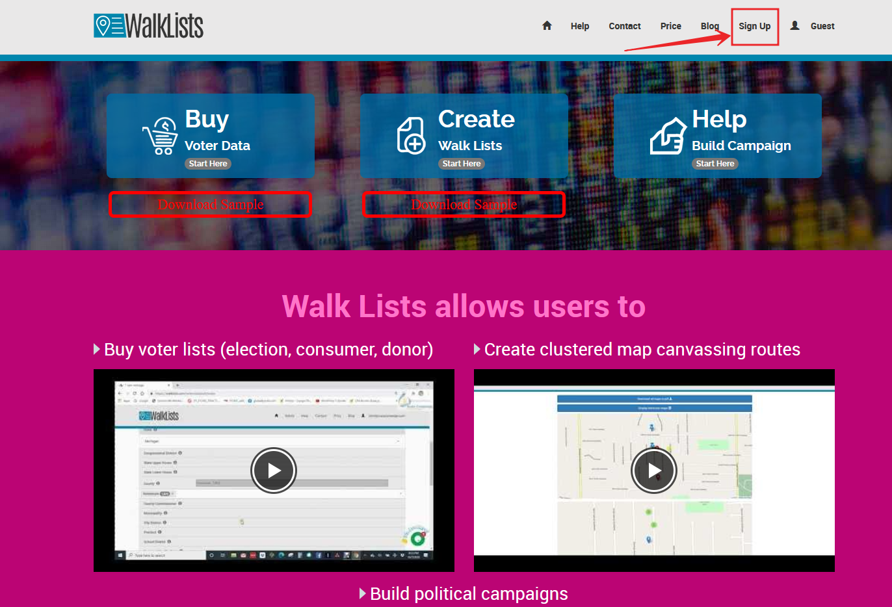
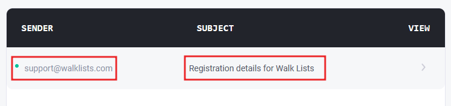
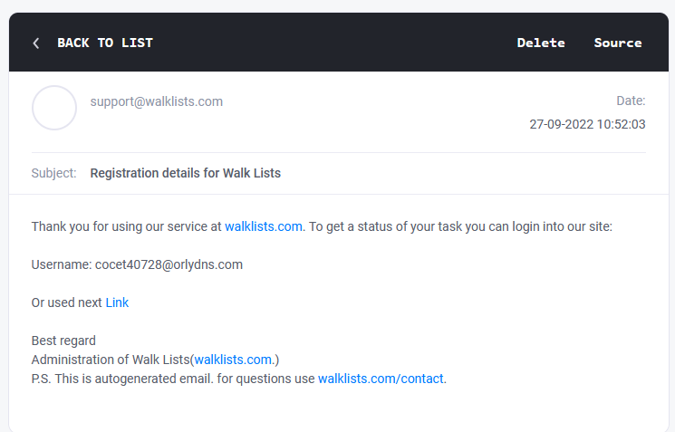
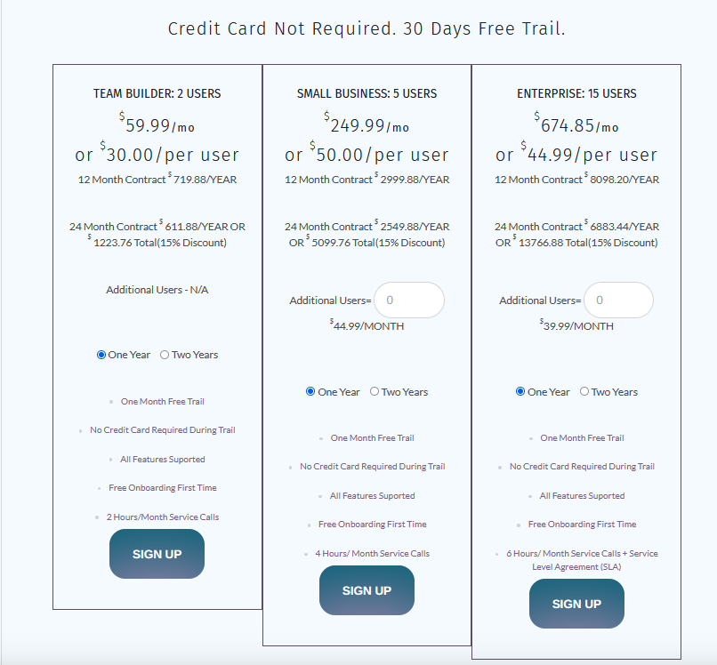

# SignUp for WalkLists

Sign up for WalkLists is a very straight process. For all services user needs to sign up just once, regardless if Data Hub or Canvassing apps are the focus of the signing.

For a start you can do it on mobile or Web broser by going on  <a href="https://walklists.com" target="_blank">WalkLists Platform </a> 

[filename](HowToSignupWithAcenjiNoCodePlatform.mp4 ':include :type=video')

There are two ways to start the sign up process

1. Sign up directly by clicking on the **Sign Up** button from the main menu.

That open s form page where basic information is collected.

  
After filling the basic Information user clicks Sign Up button from the form. Signing Up in the system is free.
 
2. Signup by an invite. 

The second option for signing up in the system is when admin or co-admin to a campaign sent an invite to a user. The invite comes in the form of an email and asks the user to sign up in the system in order to get access to the allocated campaign under their name. 
 

  

  
 

