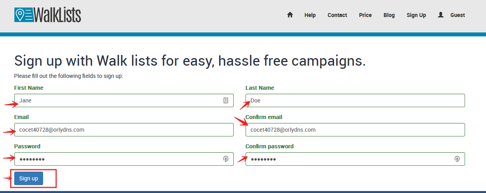

# SignUp for WalkLists

Sign up for WalkLists is a very straight process. For all services user needs to sign up just once, regardless if Data Hub or Canvassing apps are the focus of the signing.

For a start user can do it on mobile or Web broser by going on  <a href="https://walklists.com" target="_blank">WalkLists Platform </a> and click on the Sign Up Button to start the process.

That opens the Sign Up form page where user will have to set up some credential data for the process to complete. 

 After user clicks the button Sign up, user receives an email from support

The email contains some details and conformation from the signing up.

At this point user is signged up in the system fully.

Another option to signup in the system is by invitaiton. See granting access to a Campaign or Walk List  for a new user. 
 

  

  
 

